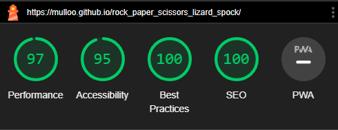

# Rock Paper Scissors Lizard Spock

Rock Paper Scissors Lizard Spock is a game just like Rock Paper Scissors but with added choices.
This game was popularized by the TV show The Big Bang Theory. This is a website where you can learn to play the game against a computer.

You can find the site here [Rock Paper Scissors Lizard Spock](https://mulloo.github.io/rock_paper_scissors_lizard_spock/)

## Features

### Added

- **Player Choices:** Choose between Rock, Paper, Scissors, Lizard and Spock.
- **Computer Opponent:** The computer opponent randomly selects its move based on the chosen difficulty level.
- **Score Tracking:** Keep track of the player's and computer's score.
- **Round Tracking:** Keep track of the number of rounds you have played.
- **Computer Choice:** Tells you know what the computer has picked.
- **PlayerChoice:** Tells you know what you picked.
- **Game Rules:** Shows the rules for anyone unfamiliar with the game.

### Not Added

- **Difficulty levels:** Choose from three different levels of challenge -Easy, Medium and Hard.

## User Stories & Feature Descriptions

- As a user, I need to be able to start the game.

- Description.
  - The start button is bright orange on a white background to make it easy to see it is also clearly placed in the center of the screen

- As a user, I need a way to make my choice.

- Description.
  - The choice buttons are in a nice light blue with a pointer attribute to signify they are choices to be clicked. They have a transition effect showing which button the user hovers over. The use of emojis makes it clear and easy to know at a glance which buttons are which.

- As a user, I need to know the rules.

- Description.

  - A list of the rules placed in a darker color to give contrast makes it easy to know the rules of the game.

- As a user, I need to know the scores.

- Description.
  - Text to show the current score of the game one for player score and one for the computer.

- As a user, I need to know the outcome of who won.

- Description.
  - Each game outcome has its own color yellow for a tie green for a win and red for a loss. This makes it clear the outcome once the user gets familiar with each outcome and its color.

- As a user, I need to know how many rounds have been played.

- Description.
  - Text to show how many rounds have been played if the user wants to go with the standard best two out of three rounds.

- As a user, I need to know what the computer chooses and what I choose

- Description.

  - Large-size text to show the user what they choose and the computer's choice so they know what to expect in the outcome slowly they will learn the game and understand the outcome of the game without the need to see it.

- As a user, I need to be able to restart the game if I want

- Description.
  - Once the player starts the game the start button text changes to restart as when they are starting they will possibly have a lackluster score thus the restart button will reset the rounds and both scores to zero.

## Game Rules

|          | Rock | Paper | Scissors | Lizard | Spock |
|----------|------|-------|----------|--------|-------|
| Rock     | -    | W     | L        | W      | L     |
| Paper    | L    | -     | W        | W      | L     |
| Scissors | W    | L     | -        | L      | W     |
| Lizard   | L    | L     | W        | -      | W     |
| Spock    | W    | W     | L        | L      | -     |

- W: Win
- L: Loss
- -: Draw

## Validation

- [HTML Validation](https://validator.w3.org/nu/?doc=https%3A%2F%2Fmulloo.github.io%2Frock_paper_scissors_lizard_spock%2F) No errors showing for the HTML.

- [CSS Validation](https://jigsaw.w3.org/css-validator/validator?uri=https%3A%2F%2Fmulloo.github.io%2Frock_paper_scissors_lizard_spock%2F&profile=css3svg&usermedium=all&warning=1&vextwarning=&lang=en) No errors showing for the CSS.

- JavaScript Validation Jshint. Showing one warning.

## Lighthouse

- Lighthouse mobile report.

- Lighthouse Desktop report.

## Manual Testing

|     Feature     |                  Action                 |                       Expected result                       | Tested | Passed |                               Comments                              |
|:---------------:|:---------------------------------------:|:-----------------------------------------------------------:|:------:|:------:|:-------------------------------------------------------------------:|
|   Start button  |        Click on the start button        |                        The game start                       |   Yes  |   Yes  | The start text changes to restart once the game container is loaded |
|  Choice Button  |   Click on one of the choices .ie rock  | The choice is passed and check then the output is displayed |   Yes  |   Yes  |          All additional dependent features function as well.          |
|  Player choice  |   Updates after choice button clicked   |                 Outputs the player's choice                 |   Yes  |   Yes  |                                  -                                  |
| Computer Choice |   Updates after choice button clicked   |                   Outputs the CPU's choice                  |   Yes  |   Yes  |                                  -                                  |
|      Rounds     |   Updates after choice button clicked   |                  Increases after each round                 |   Yes  |   Yes  |                                  -                                  |
|   Player Score  |         Updates after each round        |             Increases each time the player wins             |   Yes  |  Yes   |                                  -                                  |
|    CPU Score    |         Updates after each round        |            Increases each time the computer wins            |   Yes  |   Yes  |                                  -                                  |
|      Socials     | click the social logo you want to visit |    Bring the user to the social homepage of there choice    |  Yes   |   Yes  |                                -                                     |

## Bugs

### Fixed

- Due to a scope issue, the variable ComputerChoice was stuck as undefined this was fixed by moving multiple lines of code outside of the computerChoice function and creating a new function called mainGameLogic.
- After restarting the game the rounds and scores would jump to the previous score and rounds due to the function update variables didn't have the variables playerScore cpuScore and rounds set at all. This was fixed by setting the variables to the correct values inside this function
-

### Not Fixed

- No know unfixed bugs

## Technologies Used

- [HTML](https://www.w3schools.com/html/) is used as the foundation of the site.
- [CSS](https://www.w3schools.com/Css/) is used to add style and layout to the site.
- [JavaScript](https://www.w3schools.com/js/) is used for the main functionality of the site.
- [Flexbox](https://css-tricks.com/snippets/css/a-guide-to-flexbox/) is used to arrange items on the page.
- [VSCode](https://code.visualstudio.com/) is used as the IDE for writing and editing code.
- [Git](https://git-scm.com/) is used as a version control.
- [GitHub](https://github.com/) is used to store the repository and deploy the sites.
- [JSON](https://www.w3schools.com/whatis/whatis_json.asp) is used to store the win data.

## Design

- This pallet has bright colors to show important areas, as well as white and black to create contrast for the user to see the necessary information on the site like the outcome and score.

## Citation

- The footer is taken from the Titanfall 2 wiki repo [Titanfall](https://github.com/Mulloo/Titanfall-2-Weapon-Wiki) icons are form font awesome.
- [Icons8](https://icons8.com/icons/set/game) Favicon form Icons8.
